# Lab 9 - Access Control

Enda Lee 2023

### Quick Start

1. Download the start site from this repository and extract it to a folder named `lab9`.
2. Open the `lab9` **folder** in VS Code.
3. In a terminal run `npm install`.
4. Start the application using `npm run dev`.

This repository includes solution to the previous lab exercises. 

**You will need to add `.env` (base it on `.env.example`) and set your API keys, etc.**


## Introduction

This lab add access controls to the locations application, using Supabase Auth, see https://supabase.com/docs/guides/auth

> # Auth
>
> ## Use Supabase to authenticate and authorize your users.
>
> There are two parts to every Auth system:
>
> - **Authentication:** should this person be allowed in? If yes, who are they?
> - **Authorization:** once they are in, what are they allowed to do?
>
> Supabase Auth is designed to work either as a standalone product, or deeply integrated with the other Supabase products. Postgres is at the heart of everything we do, and the Auth system follows this principle. We leverage Postgres' built-in Auth functionality wherever possible.


This tutorial is based on (with some changes) the **[Auth Helpers Guide](https://supabase.com/docs/guides/auth/auth-helpers/sveltekit)** provided by Supabase and will use email/ password based **Authentication** using the API provided by Supabase.

**Row Level Security (RLS)** will then be used to control access to the database tables and data - this is the **Authorisation** part.


## 1. Supabase Row Level Security (RLS)

By default Supabase allows access to the database to anyone with access to the `anon` API key. Row Level Security enables access to data to be defined using `Policies`.

To try this out, enable RLS on the locations table

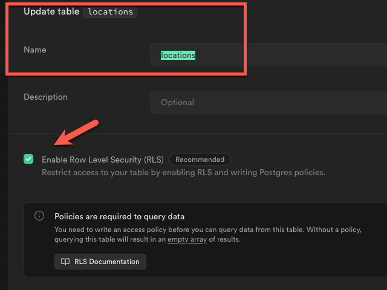


After doing this, reload the locations page in the web app. What do you see?Unless you have already set some policies, no locations will be displayed.

### 1.1. Define a policy to give access to shared locations for all users

 From the Authentication menu, open `Policies`. Then create a `New Policy`

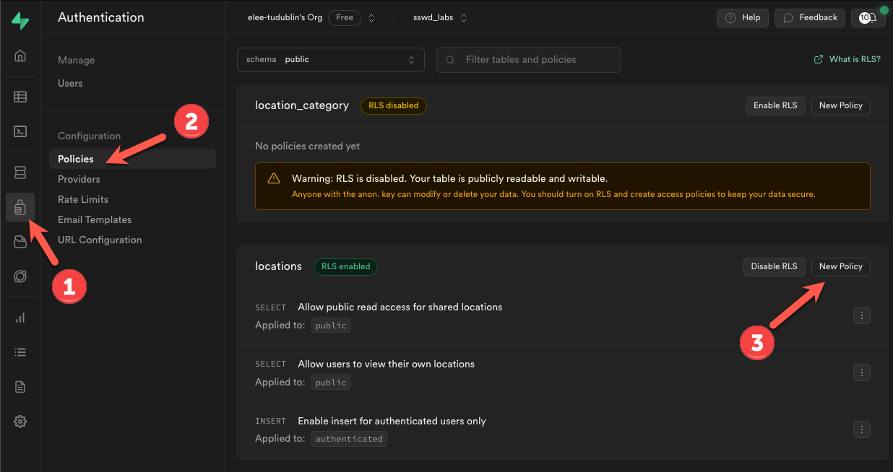


1. Browse the templates (choose the first one for this example)

   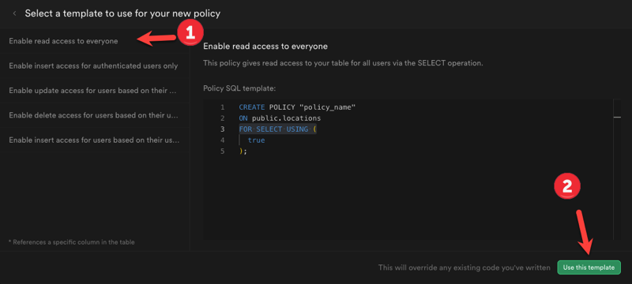

2. Name the policy and define a rule. In this example allow all users to access shared locations. `(shared = true)`

   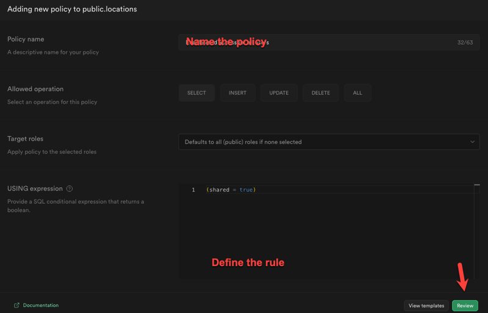


3. Save the policy

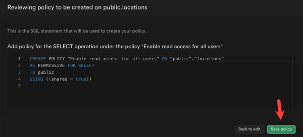


4. See if it worked.


## 2. Install Auth dependencies

Start by install the SvelteKit Auth Helpers library for Supabase. The helpers provide the Auth extensions required in the steps which follow.

```bash
npm install @supabase/ssr
```


## 3. Creating a new Supabase Client

Previous examples used a version of the Supabase client without the Auth features. This one will include Auth and will be available when handling all requests in the application. **This  is important as access control must be applied each time a user or service attempts to access something.**

A Sveltekit feature called **Hooks** will be used, see https://kit.svelte.dev/docs/hooks

> 'Hooks' are app-wide functions you declare that SvelteKit will call  in response to specific events, giving you fine-grained control over the framework's behaviour.
>
> There are two hooks files, both optional:
>
> - `src/hooks.server.js` — your app's server hooks
> - `src/hooks.client.js` — your app's client hooks
>
> Code in these modules will run when the application starts up, making them useful for initializing database clients and so on. 

Add the file `hooks.server.js` to the `src`  folder in your application.

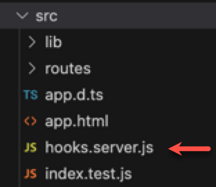


Add the following code to `hooks.server.js` and save. The purpose of this code is to declare a Supabase client for the app and also a way to access the Supabase `session`. *Read the comments for details.*

```javascript
// import depencencies
import { createServerClient } from '@supabase/ssr'

// create the supabase 'server-side' client
export const handle = async ({ event, resolve }) => {
  event.locals.supabase = createServerClient(
    import.meta.env.VITE_SUPABASE_URL,
    import.meta.env.VITE_SUPABASE_ANON_KEY,
    event
  )

  /**
   * a little helper that is written for convenience so that instead
   * of calling `const { data: { session } } = await supabase.auth.getSession()`
   * you just call this `await getSession()`
   */
  event.locals.getSession = async () => {
    const {
      data: { session },
    } = await event.locals.supabase.auth.getSession()
    return session
  }

  return resolve(event, {
    filterSerializedResponseHeaders(name) {
      return name === 'content-range'
    },
  })
}
```


### 3.1 Update the API routes to use the new client.

For example the endpoint to get all locations - `src/routes/api/locations/+server.js`

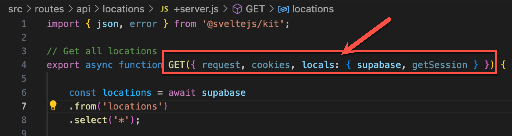


## 4. Configuring the App for Supabase Auth

These steps are required to 'wire up' the app so that it works with Supabase Auth. 

### 4.1. Define a 'Code Exchange' Route

The purpose of this is to exchange an auth **code** which uniquely identifies the user's `session`.  After a successful login, the value is set in a `cookie` which will be sent with future requests to Supabase.

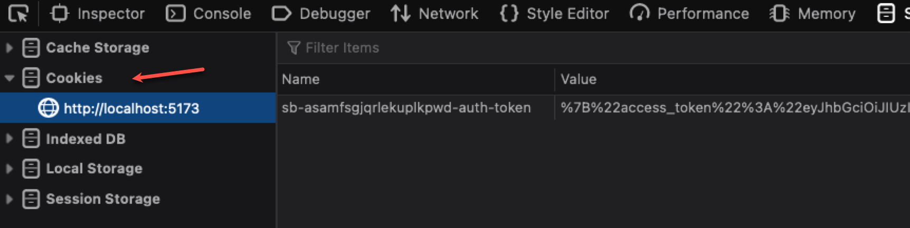

Create `/src/routes/api/auth/callback/+server.js`

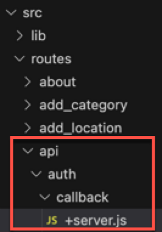


Then add the following code to the new `+server.js` file.

```javascript
import { redirect } from '@sveltejs/kit'

export const GET = async ({ url, locals: { supabase } }) => {
  const code = url.searchParams.get('code')

  if (code) {
    await supabase.auth.exchangeCodeForSession(code)
  }

  throw redirect(303, '/')
}
```


### 4.2 Generate types from your database

This step upates the application types so that the code editors like VS Code can recognise them.

Open `src/app.d.ts` and replace the existing code with the following:

```Javascript
// See https://kit.svelte.dev/docs/types#app
// for information about these interfaces

import { SupabaseClient, Session } from '@supabase/supabase-js'

declare global {
	namespace App {
		interface Locals {
			supabase: SupabaseClient
			getSession(): Promise<Session | null>
		  }
		  interface PageData {
			session: Session | null
		  }
		// interface Error {}
		// interface Platform {}
	}
}

```


## 5. Authentication

Client-side and server-side authentication are supported by the Supabase Auth helper. The **layout** routes which is shared by all other pages will be used in the following steps to share the session between client and server so that it can be used.

### 5.1 Client-side

1. The user `session` needs to be available across the application. 

   The first step is to pass the `session` for the server-side to the client-side via the layout server script, `src/routes/+layout.server.js`. The `load()` function is used to get the session and return it (to the client page) - similiar to previous exaples.

   Create `src/routes/+layout.server.js` and add the following code to the file

```javascript
// get the session from server-side and return it to the client-side
export const load = async ({ locals: { getSession } }) => {
    return {
      session: await getSession(),
    }
  }
```

2. Share the Supabase client and session via the layout.

   Add the following code to `src/routes/+layout.js`. This is very similiar to the code in `hooks.server.js` but note the use of `createBrowserClient`:

```javascript
import { createBrowserClient } from '@supabase/ssr'

/*
The usage of depends tells sveltekit that this load function should be executed
whenever invalidate is called to keep the page store in sync.
*/

export const load = async ({ fetch, data, depends }) => {
  depends('supabase:auth')

  const supabase = createBrowserClient(
    import.meta.env.VITE_SUPABASE_URL,
    import.meta.env.VITE_SUPABASE_ANON_KEY
  )

  const {
    data: { session },
  } = await supabase.auth.getSession()

  return { supabase, session }
}
```


3. Setting up the event listener on the client side. 

   This adds an event listener in the root `+layout.svelte` file in order to catch supabase events being triggered - for example login, logout, session expiry.

   Add the following to  `src/routes/+layout.svelte` :

```html
<script>
  
// @ts-nocheck

  import { invalidate } from '$app/navigation'
  import { onMount } from 'svelte'

  // get data returned by srver and client load
  export let data;

  let { supabase, session } = data;

  // $ defines the values as reactive so that changes in values automatically update dependants.
  $: ({ supabase, session } = data);


  // Check whats happening to the session
  console.log('session: ', JSON.stringify(session));

  // executes after the page renders
  // Check if session is valid, if not: invalidate
  onMount(() => {
    const {
      data: { subscription },
    } = supabase.auth.onAuthStateChange((event, _session) => {
      if (_session?.expires_at !== session?.expires_at) {
        invalidate('supabase:auth');
      }
    })

    return () => subscription.unsubscribe();
  });

  // logout() function - sign out and invalidate the session
  async function logout() {
    await supabase.auth.signOut();
  }

</script>
```


## 6. Register, Login, and Logout

Supabase includes an Auth schema. Registered users can be found in the `users` table.

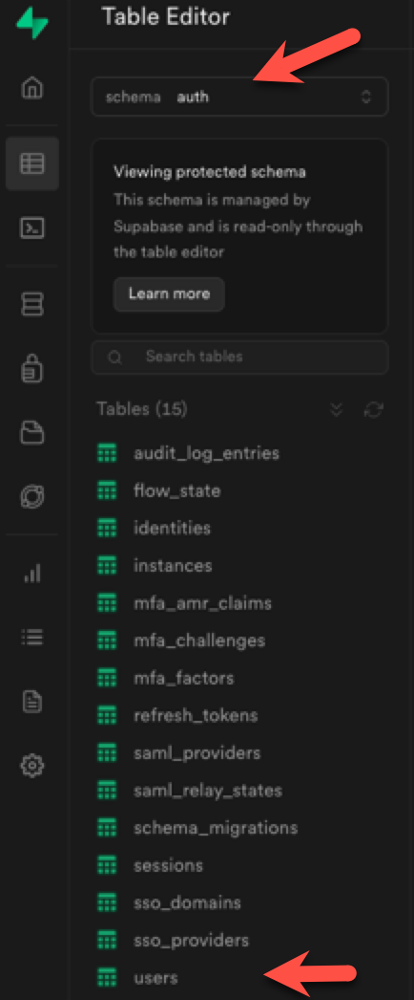

### 6.1 Register

The registration route will allow new users to create accounts. Create a new folder, `routes/register` and add `+page.server.js` and `+page.svelte`

The form validation and submit action are defined in `+page.server.js`

```javascript
import { fail } from '@sveltejs/kit';
import { z } from 'zod';
import { superValidate, message } from 'sveltekit-superforms/server';

// Supervalidate schema for the registration form
const schema = z.object({
  email: z.string(),
  password: z.string()
});

// Page load
// Build the form and returns to page
export async function load({ fetch, params }) {
  // Build form
  const form = await superValidate(schema);

  // Return form
  return {
      form
  };
}

// Form actions (e.g. what to do when submit happens)
export const actions = {
  // default form submit
  default: async ({ request, url, locals: { supabase } }) => {
      // retrieve form data and validate
      const form = await superValidate(request, schema);
      //console.log('POST', form);

      if (!form.valid) {
          return fail(400, { form });
      }
      // read the form data
      const email = form.data.email;
      const password = form.data.password;

      // call the supabase api to create a new account
      const { error } = await supabase.auth.signUp({
        email,
        password,
        options: {
          // redirect and pass id to client side
          emailRedirectTo: `${url.origin}/api/auth/callback`,
        },
      })
  
      if (error) {
        return fail(500, { message: 'Server error. Try again later.', success: false, email })
      }
  
      // return form and message
      return message(form, `success: Please check your email for a magic link to log into the website.`);
  }
};

```


The form is defined in `+page.svelte`

```html
<script>
	/** @type {import('./$types').PageData} */

	// dependencies
	import { page } from '$app/stores';
	import { superForm } from 'sveltekit-superforms/client';

	export let data;

	// create form instance
	const { form, errors, enhance, delayed, message, constraints, reset } = superForm(data.form);
</script>

<div class="m-5">
	<!-- Otherwise show the form -->
  {#if $message}
  <p>{$message}</p>
  {/if}
	<h1>Sign up and register</h1>
	<!-- Bootstrap Form Layout-->
	<div class="w-75 mw-300 p-3">
		<!-- this form will post when submitted -->
		<form method="POST" use:enhance>

			<!-- email -->
			<div class="mb-3">
				<label for="email" class="form-label">Email</label>
				<input type="email" name="email" class="form-control" bind:value={$form.email} />
			</div>

			<!-- password -->
			<div class="mb-3">
				<label for="password" class="form-label">Password</label>
				<input type="password" name="password" class="form-control" bind:value={$form.password} />
			</div>

			<!-- submit button -->
			<div class="mb-3 mt-3">
				<button class="btn btn-primary">Register</button>
			</div>
		</form>
	</div>
</div>
```


**Exercise:** After adding this route, test it and verify that the user was added to the database.


### 6.2 Log in / Logout

The `logout()` function is already devide. in the root `+layout.svelte` and will be used later.

Define the login form as a Svelte **Component**. Thisis so it can be reused as required. Components should be defined in the `src/lib/components` folder:

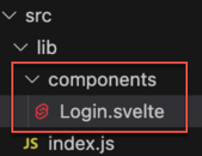


The form has been defined as a Bootstrap modal so that it can be displayed in another page. The form allows the users email and password to be filled in. The sign in button calles `handleSignIn()` which uses Supabase Auth to authenticate the user.  A successful login will update `supabase.auth.onAuthStateChange`, defined previously, and a user session will be created.

Add the following code to `Login.svelte`:

```html
<script>
	 /**
	 * @type {{ auth: { signInWithPassword: (arg0: { email: string; password: string; }) => any; }; }}
	 */
	  export let supabase;

	/** @type {string}*/
	let email;
	/** @type {string}*/
	let password;

  // Call Supabase Auth with user credentials
	const handleSignIn = async () => {
		await supabase.auth.signInWithPassword({
			email,
			password
		});
	};
</script>

<!-- Modal -->
<div
	class="modal fade"
	id="loginModal"
	tabindex="-1"
	aria-labelledby="modalLogin"
	aria-hidden="true">

	<div class="modal-dialog">
		<div class="modal-content">
			<div class="modal-header">
				<h1 class="modal-title fs-5" id="exampleModalLabel">Login</h1>
				<button type="button" class="btn-close" data-bs-dismiss="modal" aria-label="Close" />
			</div>
			<div class="modal-body">
				<form>
					<!-- email -->
					<div class="mb-3">
						<label for="email" class="form-label">Email</label>
						<input type="text" name="email" class="form-control" bind:value={email} />
					</div>

					<!-- password -->
					<div class="mb-3">
						<label for="password" class="form-label">Password</label>
						<input type="password" name="password" class="form-control" bind:value={password} />
					</div>
				</form>
				<button on:click="{handleSignIn}" class="btn btn-primary" data-bs-dismiss="modal">Login</button>
			</div>
			<div class="modal-footer">
				<button type="button" class="btn btn-secondary" data-bs-dismiss="modal">Close</button>
			</div>
		</div>
	</div>
</div>

```


#### 6.2.1. Using the login form

Open the root layout page , `+layout.svelte`.

1. Import the `Login` component in the script section:

   ```javascript
   import Login from '$lib/components/Login.svelte'
   ```

2. Add the component to `+layout.svelte` . Note that the supabase instance is passed to the component via `bind:`

   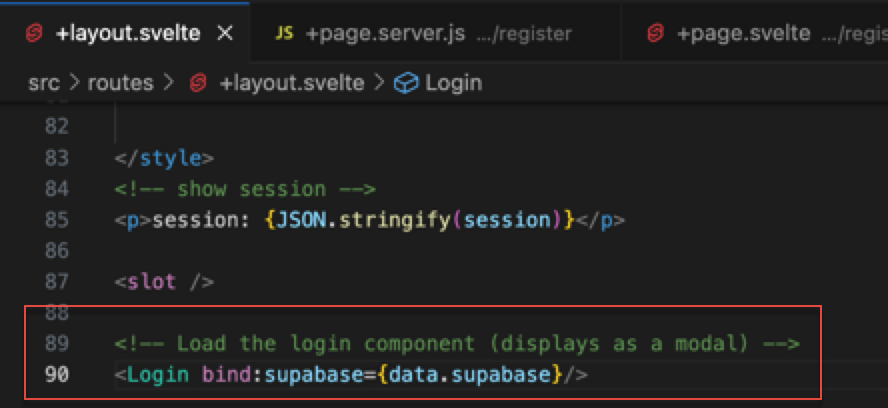

3. Add links for login / logout to `+layout.svelte`

   Add the following to the page. The `if` block shows login or logout depending on whether `session` exists.

   ```html
           <!-- use session state to show login or logout -->
           {#if !session}
               <button id="Login" type="button" class="btn nav-link btn-color" 
               data-bs-toggle="modal" data-bs-target="#loginModal">
               Login
               </button>
           {:else}
               <button on:click={logout} id="Logout" type="button" 
               class="btn nav-link btn-color">
               Logout
               </button>
           {/if}
   ```

   ```css
   <style>
   	nav a {
   		color: yellow;
   	}
       .btn-color {
           color: yellow;
       }
   </style>
   ```


**Exercise:** Test the application and verify that login and logout work. Display `{JSON.stringify(session)}` in the page to see what it contains.


## 7. Allow users to view their own locations

The purpose of this step is to modify the applcation so that users only see their own locations nd shared locations

### 7.1. Location table modifications

First, modify the locations table to include a colum for user. This will give each location an owner. name the column `user_id` with data type `uuid` and default value `auth.uid()`. Now when a new location is added, the id of the logged in user will be added to the row.


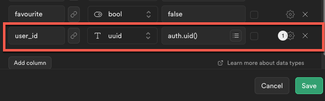

### 7.2. Enable insert for authenticated users only

Add a new RLS policy to locations - based on the `Enable insert access for authenticated users only` template. No changes are required.

After adding, make sure that it works and verify that the users id is added when a new location is inserted.


### 7.3. Allow users to view their own locations.

This policy is based on `Enable read access to everyone` but with the expression set to `(auth.uid() = user_id)`.  When enabled, the logged in user will see their own and shared locations only.


## 8. Exercises

Enable RLS for the `location_category` table and add the following policies:

1. All all users to read/ select.
2. Only allow autenticated users to insert.


------

Enda Lee 2023